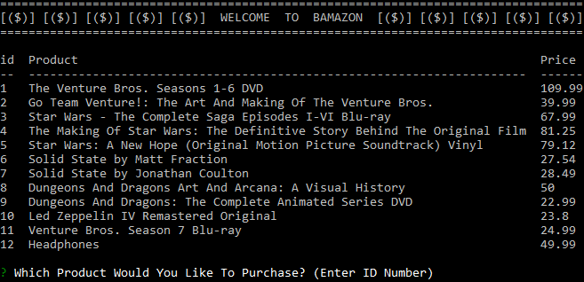
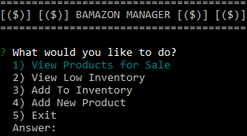
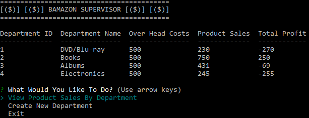

# Bamazon

Demo Video: [bamazon-demo](http://bit.ly/bamazon-demo)

## Overview

Bamazon is an Amazon-like storefront that will take in orders from customers and deplete stock from the store's inventory, track product sales across your store's departments and then provide a summary of the highest-grossing departments in the store.

### Challenge #1: Customer View (Minimum Requirement)

A Node application (bamazonCustomer.js) that displays all the items for sale, including their id, name, and price.  The user can purchase multiple quantities of any item, as long as there is enough in stock.

### Challenge #2: Manager View (Next Level)

A second Node application (bamazonManager.js) that lets the manager view all the items in stock, view which items are low in inventory (less than 5), add existing products back into supply, and add new products.

### Challenge #3: Supervisor View (Final Level)

A third Node Application (bamazonSupervisor.js) that lets the supervisor view product sales by department and create new departments.